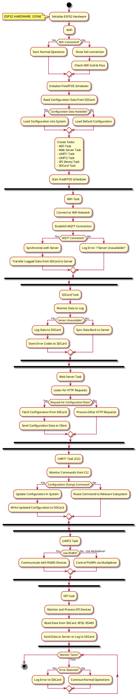

#line 1 "d:\\FMS Framework\\fms_framework\\src\\fms_flow.md"

```plantuml
@startuml
skin rose
start
:Initialize ESP32 Hardware;
note left
ESP32 HARDWARE  DONE
end note
: WiFi;
if (WiFi Connected?) then (Yes)
    :Start Normal Operation;
else (No)
    : Show Fail connection;
    : Check WiFi Ssid & Pass;

endif

:Initialize FreeRTOS Scheduler;

:Read Configuration Data from SDCard;
if (Configuration Data Available?) then (Yes)
    :Load Configuration into System;
else (No)
    :Load Default Configuration;
endif

:Create Tasks:
- WiFi Task
- Web Server Task
- UART1 Task
- UART2 Task
- SPI Device Task
- SDCard Task;
:Start FreeRTOS Scheduler;

fork
:WiFi Task;
:Connect to WiFi Network;
:Establish MQTT Connection;
if (MQTT Connected?) then (Yes)
    :Synchronize with Server;
    :Transfer Logged Data from SDCard to Server;
else (No)
    :Log Error: \"Server Unavailable\";
endif
endfork

fork
:SDCard Task;
:Monitor Data to Log;
if (Server Unavailable?) then (Yes)
    :Log Data to SDCard;
    :Store Error Codes to SDCard;
else (No)
    :Sync Data Back to Server;
endif
endfork

fork
:Web Server Task;
:Listen for HTTP Requests;
if (Request for Configuration Data?) then (Yes)
    :Fetch Configuration from SDCard;
    :Send Configuration Data to Client;
else (No)
    :Process Other HTTP Requests;
endif
endfork

fork
:UART1 Task (CLI);
:Monitor Commands from CLI;
if (Configuration Change Command?) then (Yes)
    :Update Configuration in System;
    :Write Updated Configuration to SDCard;
else (No)
    :Route Command to Relevant Subsystem;
endif
endfork

fork
:UART2 Task;
if (Use RS485?) then (Yes)
    :Communicate with RS485 Devices;
else (No - Use Multiplexer)
    :Control PUMPs via Multiplexer;
endif
endfork

fork
:SPI Task;
:Monitor and Process SPI Devices;
:Read Data from SDCard, RFID, RS485;
:Send Data to Server or Log to SDCard;
endfork

while (Monitor Tasks?) is (True)
    if (Error Detected?) then (Yes)
        :Log Error to SDCard;
    else (No)
        :Continue Normal Operations;
    endif
endwhile

stop

@enduml

```